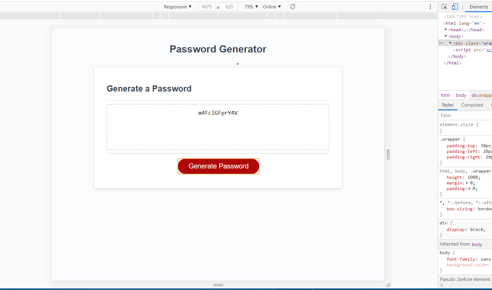

# passwordGen
Random password generator 

Description:
This page generates a random password giving the user th eoption to set the length and whether they want to use Uppercase characters, lowercase characters, numbers and special characters.  Then it display the new password on the screen for them.

Linl to github repository: 
https://github.com/marklaham/passwordGen

Link to live site:
https://marklaham.github.io/passwordGen

Screen shot of deployed site:

 